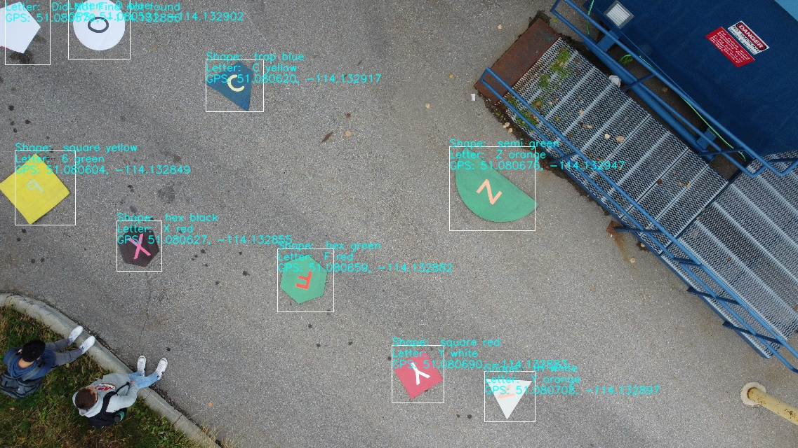
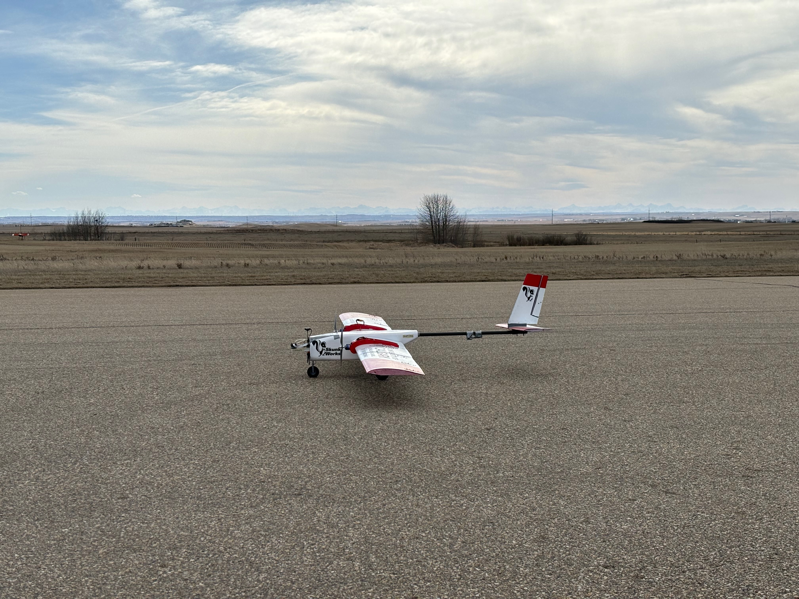
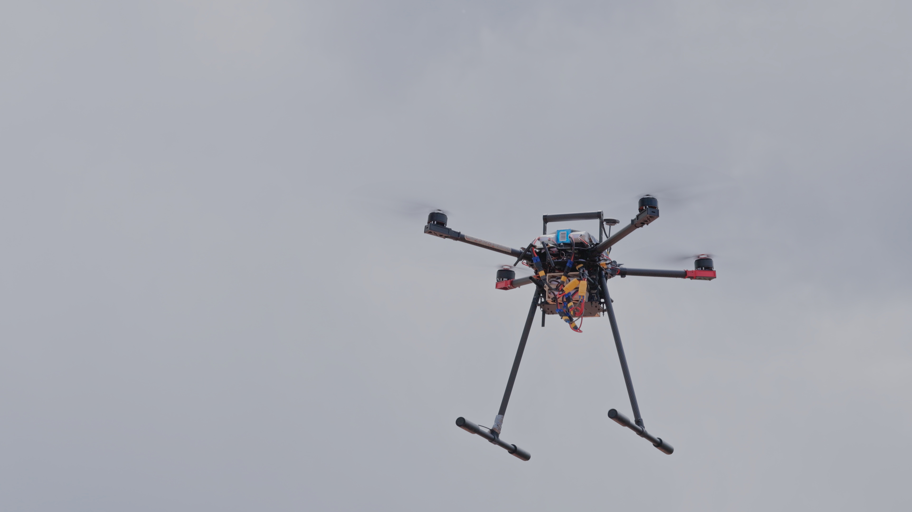

# Hi, I'm Liam 👋

### About Me

I'm a software engineering student at the University of Calgary, passionate about aerospace software and aeronautics. 

Currently, I work at an aerospace company, focusing on unmanned vehicle control software. I serve as one of two avionics leads for Schulich Unmanned Aerial Vehicles, overseeing all aspects of electrical, systems, and software engineering. Previously, I contributed to the development of Symmetry process simulation software at SLB.

In my free time, you can find me watching football or hockey, taking care of my dog, and spending time with friends.

### Current Projects

I'm developing an autonomous quadcopter system designed to fly over 15 miles and perform targeted airdrops using a winch mechanism. This project includes the following sub-projects:

- **Flight Control System Software:** Developing and synchronizing flight controller software with electronic speed controllers (ESCs).
- **Web Development:** Creating ground control station software for monitoring and managing flight operations.
- **Embedded Systems:** Implementing remote triggering mechanisms for imaging systems and stepper motors, and integrating these with the flight controller.
- **Artificial Intelligence:** Utilizing convolutional neural networks for computer vision applications.

### Connect with Me

  
   
  

